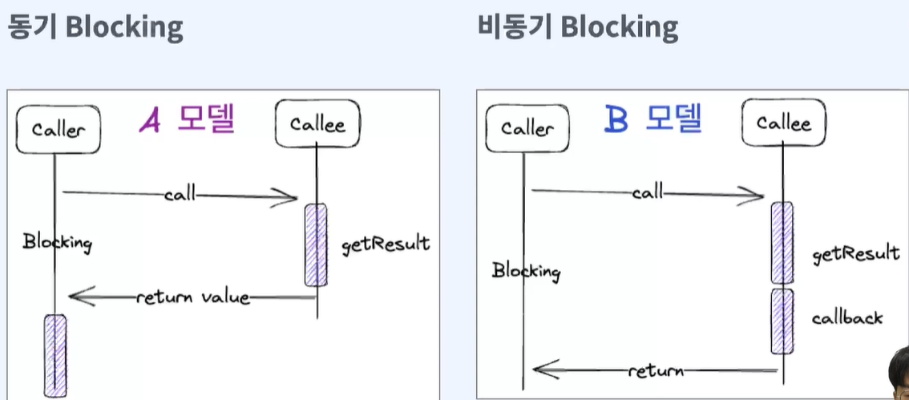
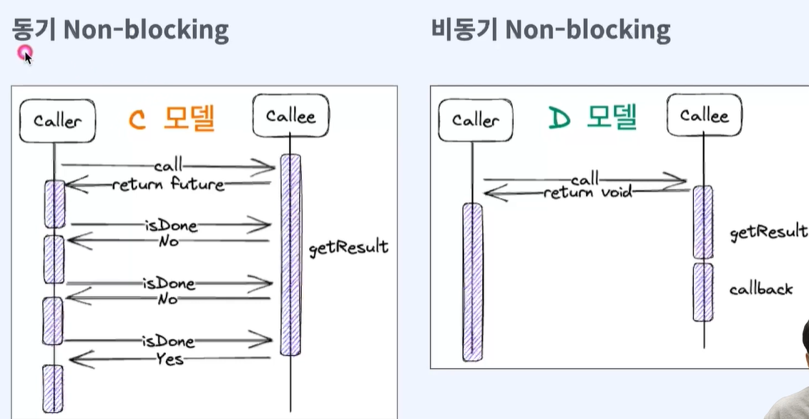
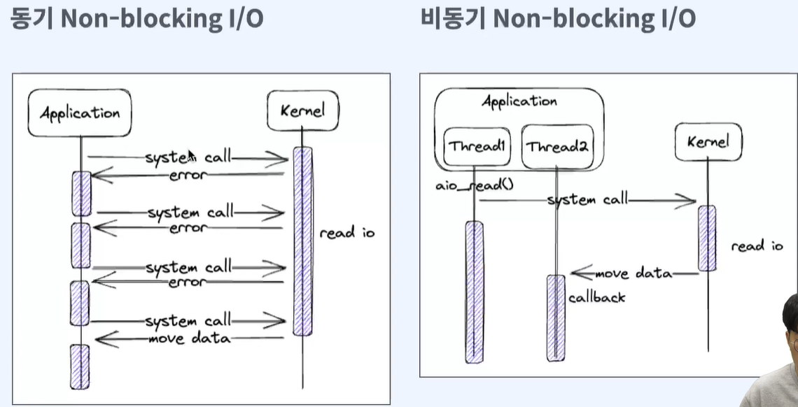

# Spring Webflux 완전 정복 : 코루틴부터 리액티브 MSA 프로젝트까지

## 1. 비동기 프로그래밍
- 함수를 1급 객체로 사용할 수 있음(변수에 할당하거나, 인자로 전달하고 반환값으로 사용 가능)
- 동기 vs 비동기 : 동기는 요청 후 결과값에 관심이 있고, 비동기는 요청 후 결과값에 관심이 없음
- 블로킹 vs 논블로킹 : 블로킹은 요청 후 결과를 받을 때까지 대기해야 하고, 비동기는 요청 후 결과 값을 받을 때까지 대기하지 않아도 된다.
- 
- 
- 
  |              | 동기                                            | 비동기                                           |
  |--------------|-----------------------------------------------|-----------------------------------------------|
  | Blocking     | caller는 아무것도 할 수 없는 상태가 된다. 결과를 얻은 후 직접 처리한다. | caller는 아무것도 할 수 없는 상태가 된다. 결과는 callee가 처리한다. |
  | Non-blocking | caller는 자기 할 일을 할 수 있다. 결과를 얻은 후 직접 처리한다.     | caller는 자기 할 일을 할 수 있다. 결과는 callee가 처리한다.     |
ㄹ
### blocking의 전파 
- 하나의 함수에서 여러 함수를 호출하기도 하고, 함수 호출은 중첩적으로 발생함. 
- 이 중 blocking한 함수를 하나라도 호출한다면 caller는 blocking이 된다.
- 따라서 함수가 non blocking이기 위해서는 모든 함수가 non-blocking이어야 한다.(IO blocking 또한 발생하면 안됨)

### IO관점에서 blocking과 non-blocking

- 비동기 non blocking은 요청과 응답 스레드가 별개로 동작

## 2. CompletableFuture
### thenAccept

- 따라서 thenAsync는 항상 스레드풀에서 실행하므로, blocking하지 않아 유리

### thenApply