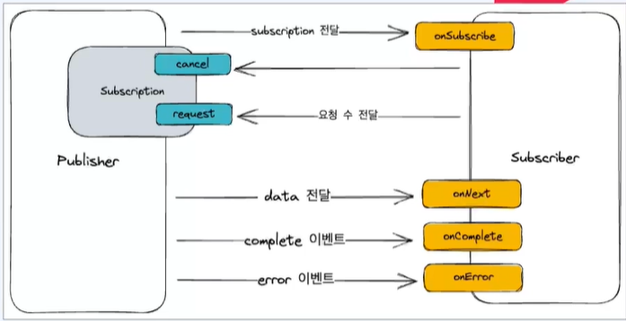

# Spring Reactive Stack
## 1. Netty
## 2. Reactor
### 2-1. Reactor streams
- 비동기 데이터 스트림 처리를 위한 표준
- Publisher와 Subscriber 비동기적으로 이벤트를 전달

- 
- onSubscribe : subscriber와 publisher 사이에 연결이 시작될 때 호출. Subscription 객체를 전달
- onNext : Publisher 데이터를 생성하고 Subscriber 전달. Subscriber 데이터를 받고 처리
- onComplete: 모든 아이템이 전달 완료. 더 이상 전달할 데이터가 없을 때 호출. Publisher와 Subscriber의 연결이 종료
- onError: 데이터 스트림 처리 중 오류가 발생했을 때 호출. 오류 정보를 전달하고 Publisher와 Subscriber의 연결이 종료

### 2-2. Reator
- Reative streams를 구현한 비동기 데이터 스트림 처리를 지원
- Spirng webflux에서 메인으로 사용
- backpressure를 제공하여 안정성을 높이고, 다양한 연산자로 다양한 연산들을 조합하여 가독성 증대

## 3. Spring webflux
## 4. Server sent event
## 5. Websocket
## 6. Spring security reactive