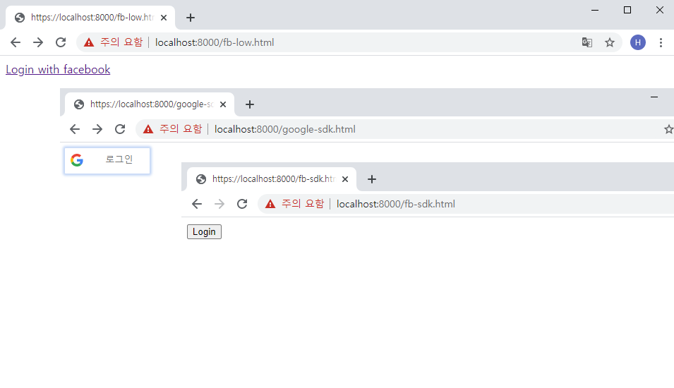

# Oauth 간단 예제
페이스북 및 구글 Login, Logout을 통한 Oauth 간단 실습 예제


## 설치
node.js를 사용해 개발된 local web server를 이용해 웹서버를 기동하므로, npm실행이 가능한 환경이어야 한다.
npm을 통해 local web server를 설치한다.
```
npm install -g local-web-server
```
## 실행
예제에 사용된 클라이언트id 및 리다이렉트uri는 현재 모두 사용이 중지된 상태.
따라서 실제로 기동하기 위해서는 페이스북 및 구글 개발자 페이지에서 별도의 인증과정이 필요하다.
```
ws
```
- 페이스북 바닐라 자바스크립트 활용 예제: https://localhost:8000/fb-low.html
- 페이스북SDK 활용 예제: https://localhost:8000/fb-sdk.html
- 구글SDK 활용 예제: https://localhost:8000/google-sdk.html
