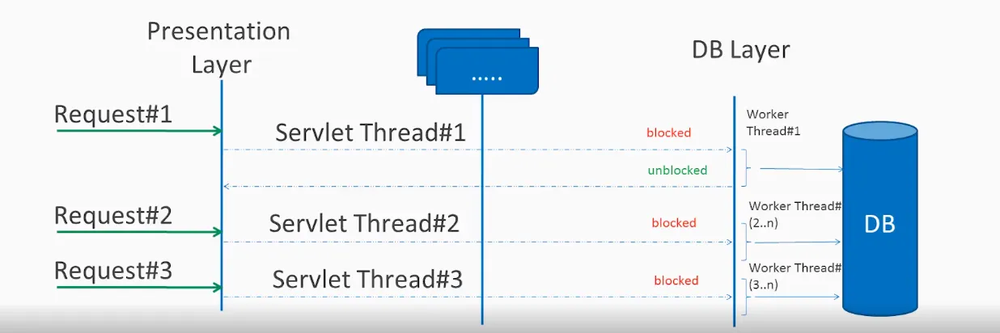

# Spring5 Webflux
Spring 5.0부터 reactive stack web framework인 webflux가 추가됨
논블로킹을 지원하며, reactive streams back pressure를 지원하고,
netty기반의 서버에서 동작한다.
(Reactive Streams API는 현재 java9에 포함되어 있음)

##Blocking 요청처리

전통적인 MVC어플리케이션에서는, 서버에 요청에 오면 Servlet thread가 생성되고,
DB Layer 접근과 같은 IO작업을 위해 Worker thread에 요청을 위임한다.
이때, Worker thread가 사용 중인 동안에는 Servlet Thread가 대기 상태를 유지하므로
block된다.

따라서 이는 성능을 저하시키고 서버 기능을 제한하게 된다.

## Non-blocking 요청 처리

Blocking방식과 달리, 대기 상태의 스레드가 없다. 

요청스레드 하나만 있으며, 수신되는 모든 요청은 이벤트 핸들러 및
콜백 정보와 함께 들어온다. 요청 스레드는 요청을 스레드풀에 위임하고, 즉시 요청 스레드로부터 들어온 요청을 처리하기 시작한다.

## Reactive programming?
변화에 대한 반응을 중심으로 개발된 프로그래밍 모델을 말한다.

observer패턴이라고 부르는 publisher-subscriber패턴 중심으로 개발되며,
리액티브 스타일의 프로그래밍에서는 리소스를 요청하고, 다른 일을 수행하기 시작한다.
데이터를 사용할 수 있게되면 콜백으로 데이터와 함께 알림을 받는다.

참고: https://howtodoinjava.com/spring-webflux/spring-webflux-tutorial/